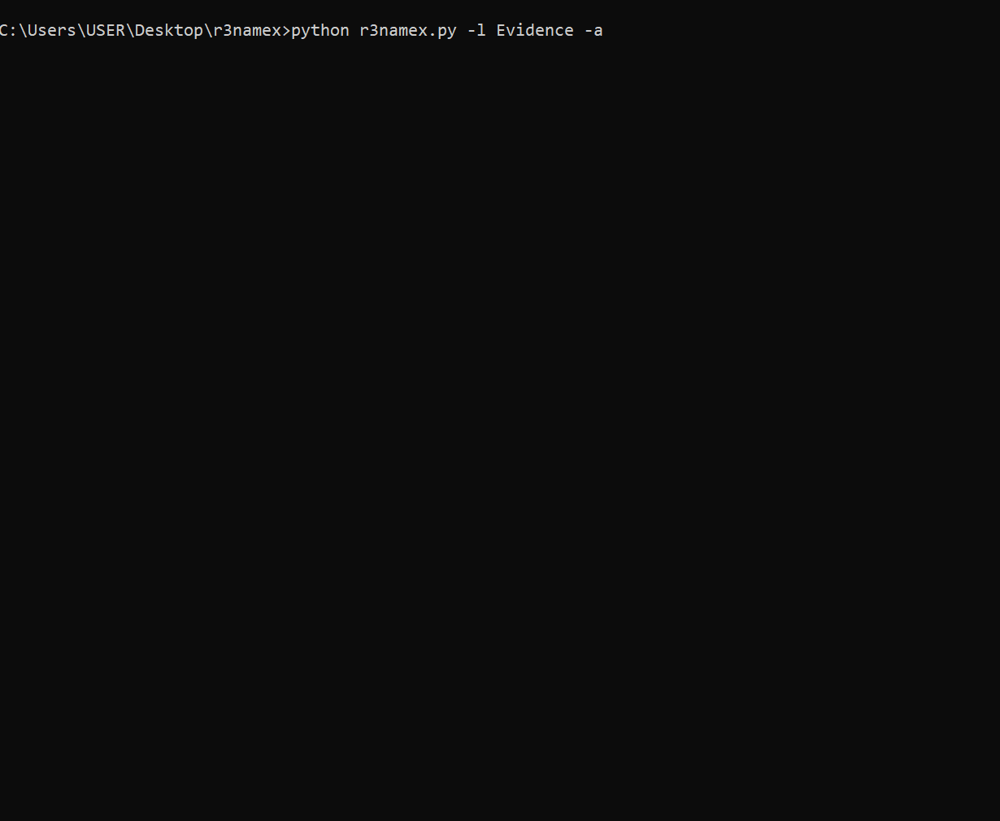
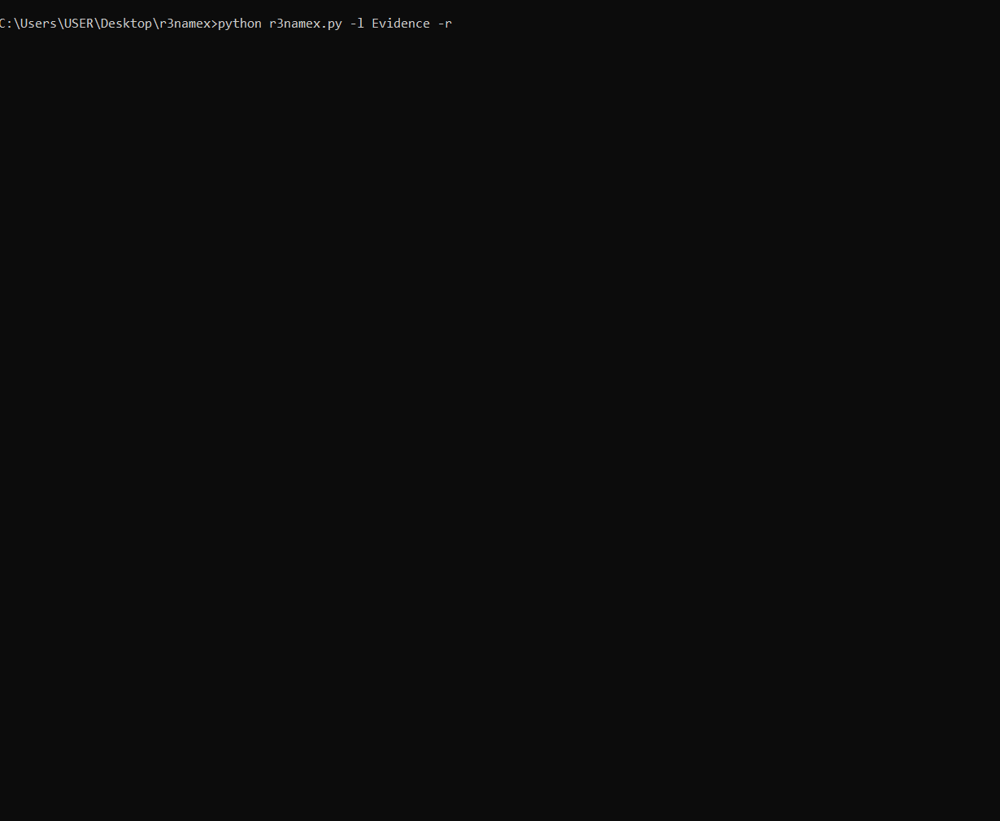

# r3namex - Batch File Renaming Tool


**r3namex** is a powerful and efficient batch file renaming tool with advanced features like rollback functionality, duplicate handling, and recursive folder processing. Perfect for organizing large collections of files with safety and precision.


```
  _____  ____                            __   __
 |  __ \|___ \                           \ \ / /
 | |__) | __) |_ __   __ _ _ __ ___   ___ \ V /
 |  _  / |__ <| '_ \ / _` | '_ ` _ \ / _ \ > <
 | | \ \ ___) | | | | (_| | | | | | |  __// . \
 |_|  \_\____/|_| |_|\__,_|_| |_| |_|\___/_/ \_\

        Created by Fabian Peña (stuxboynet)
                    Version 2.0.0

Batch file renaming tool with rollback functionality – efficient, simple, and powerful.

Rename multiple files with custom prefixes and numbering, handle duplicates intelligently,
and rollback changes when needed. Perfect for organizing photos, documents, and any file collections.

Usage: r3namex.py [-h] [-l LOCATION] [-p PREFIX] [-a] [-cs CURRENT_START]
                  [-ce CURRENT_END] [-ns NEW_START] [-r]
                  [-ds {skip,suffix,backup,overwrite,ask}]

Options:
  -h, --help            Show this help message and exit
  -l, --location        Folder where files are located
  -p, --prefix          Prefix of files (optional)
  -a, --all             Interactive rename for all files in directory and subfolders
  -cs, --current-start  Start of current range
  -ce, --current-end    End of current range
  -ns, --new-start      New start point for renaming
  -r, --rollback        Revert last renaming operation
  -ds, --duplicate-strategy
                        How to handle duplicate filenames (default: ask)
                        Choices: skip, suffix, backup, overwrite, ask

EXAMPLES:

To rename and enumerate all files:

    python r3namex.py -l /images -a -p Photo -ns 10
    python r3namex.py --location /images --all --prefix Photo --new-start 10

To renumber files with numbering:

    python r3namex.py -l /my/folder -p Evidence -cs 1 -ce 3 -ns 5
    python r3namex.py --location /my/folder --prefix Evidence --current-start 1 --current-end 3 --new-start 5

To revert renaming (rollback):

    python r3namex.py -l /my/folder -p Evidence -r
    python r3namex.py --location /my/folder --prefix Evidence --rollback

To handle duplicates:

    python r3namex.py -l /my/folder -p Photo -cs 1 -ce 5 -ns 1 -ds suffix
    python r3namex.py --location /my/folder --prefix Photo --current-start 1 --current-end 5 --new-start 1 --duplicate-strategy suffix

```


## 🚀 Features

- **✨ Interactive Mode**: Rename all files in directories and subdirectories with custom prefixes and numbering
- **🔢 Range Renumbering**: Renumber specific file ranges (e.g., IMG1-IMG50 to IMG100-IMG150)
- **↩️ Complete Rollback**: Undo any renaming operation with a single command
- **📁 Recursive Processing**: Process folders level by level with full control
- **🛡️ Duplicate Handling**: Multiple strategies for handling filename conflicts:
  - Skip duplicates
  - Add numeric suffix
  - Backup existing files
  - Overwrite with hidden backup
  - Interactive selection
- **📝 Operation Logging**: Track all operations in detailed log files
- **🔐 Safe Operations**: Permission checks and confirmation prompts
- **💾 JSON Mapping**: Stores operations in JSON format for reliable rollback
- **🔄 Auto-Update**: Built-in update checker to always stay current
- **📊 Version Info**: Check your version and system information easily

## 🎬 Demo

### Interactive Mode in Action


### Rollback Feature


## 📥 Installation

1. Clone the repository:
```bash
git clone https://github.com/stuxboynet/r3namex.git
cd r3namex
```

2. Ensure Python 3.6+ is installed:
```bash
python --version
```

3. No external dependencies required! The tool uses only Python standard library.

## 🎯 Usage

### Basic Commands

#### Interactive Mode - Rename All Files
```bash
python r3namex.py -l /path/to/folder -a
```

#### Rename with Custom Prefix and Starting Number
```bash
python r3namex.py -l /images -a -p Photo -ns 100
```

#### Renumber Specific Range
```bash
python r3namex.py -l /folder -p IMG -cs 1 -ce 50 -ns 100
# This renames IMG1 through IMG50 to IMG100 through IMG150
```

#### Rollback Last Operation
```bash
python r3namex.py -l /folder -r
```

#### Check Version
```bash
python r3namex.py -v
# Shows version, author, and system information
```

#### Check for Updates
```bash
python r3namex.py -u
# Checks GitHub for newer versions and offers to update automatically
```

### Command Line Arguments

| Argument | Short | Description |
|----------|-------|-------------|
| `--location` | `-l` | Target folder path |
| `--all` | `-a` | Interactive mode for all files |
| `--prefix` | `-p` | File prefix (optional) |
| `--current-start` | `-cs` | Start of current number range |
| `--current-end` | `-ce` | End of current number range |
| `--new-start` | `-ns` | New starting number |
| `--rollback` | `-r` | Revert last operation |
| `--duplicate-strategy` | `-ds` | How to handle duplicates |
| `--version` | `-v` | Show version information |
| `--update` | `-u` | Check for updates |

### Duplicate Handling Strategies

- **ask** (default): Prompts for each conflict
- **skip**: Skip files if destination exists
- **suffix**: Add numeric suffix (_1, _2, etc.)
- **backup**: Backup existing file before renaming
- **overwrite**: Replace existing file (with hidden backup)

## 📸 Examples

### Example 1: Organize Photos by Event
```bash
# Rename all photos in vacation folder
python r3namex.py -l /photos/vacation -a -p Vacation2024_ -ns 1

# Result:
# DSC0001.jpg → Vacation2024_1.jpg
# DSC0002.jpg → Vacation2024_2.jpg
# IMG_234.jpg → Vacation2024_3.jpg
```

### Example 2: Fix Numbering Gaps
```bash
# You have: Evidence1, Evidence2, Evidence5, Evidence8
# You want: Evidence1, Evidence2, Evidence3, Evidence4

python r3namex.py -l /cases -p Evidence -cs 1 -ce 8 -ns 1 -ds suffix
```

### Example 3: Process Nested Folders
```bash
python r3namex.py -l /projects -a

# Processing: MAIN FOLDER
# Files in this folder: 10
# > Do you want to set a new prefix? [Y/N]: Y
# > Enter new prefix: Project_
# > Start numbering from: 1

# Found 3 subfolder(s) with files:
#   1. designs (15 files)
#   2. documents (8 files)
#   3. archives (20 files)
# Do you want to rename files in these subfolders? [Y/N]: Y
```

## 🔄 Workflow Example

1. **Initial State**:
   ```
   photos/
   ├── IMG_1234.jpg
   ├── DSC0001.jpg
   ├── photo.jpg
   └── vacation/
       ├── beach1.jpg
       └── beach2.jpg
   ```

2. **Run Interactive Rename**:
   ```bash
   python r3namex.py -l photos -a -p Photo -ns 1
   ```

3. **After Renaming**:
   ```
   photos/
   ├── Photo1.jpg
   ├── Photo2.jpg
   ├── Photo3.jpg
   └── vacation/
       ├── Beach1.jpg
       └── Beach2.jpg
   ```

4. **Rollback if Needed**:
   ```bash
   python r3namex.py -l photos -r
   # Files return to original names
   ```

## 🛡️ Safety Features

- **Confirmation Prompts**: Always asks before executing operations
- **Permission Checks**: Verifies write permissions before starting
- **Detailed Previews**: Shows all changes before applying them
- **Complete Rollback**: Every operation can be undone
- **Backup Options**: Multiple strategies to prevent data loss
- **Operation Logging**: `logs.log` tracks all actions with timestamps

## 📁 Generated Files

- **logs.log**: Detailed operation history
- **backup_mapping.json**: Rollback information (deleted after successful rollback)
- **.rename_backups/**: Hidden folder containing file backups (when using backup strategy)

## 🤝 Contributing

Contributions are welcome! Please feel free to submit a Pull Request. For major changes, please open an issue first to discuss what you would like to change.

1. Fork the repository
2. Create your feature branch (`git checkout -b feature/AmazingFeature`)
3. Commit your changes (`git commit -m 'Add some AmazingFeature'`)
4. Push to the branch (`git push origin feature/AmazingFeature`)
5. Open a Pull Request

## 📝 License

This project is licensed under the BSD 3-Clause License - see the [LICENSE](LICENSE) file for details.

## 👨‍💻 Author

**stuxboynet**
- GitHub: [@stuxboynet](https://github.com/stuxboynet)

## 🙏 Acknowledgments

- Inspired by the need for a safe, powerful batch renaming tool
- Built with Python's robust file handling capabilities
- Special thanks to all contributors and users

## 📈 Roadmap

- [ ] GUI version using tkinter
- [ ] Regular expression support for advanced matching
- [ ] Preview mode with dry-run capability
- [ ] Export/import renaming templates
- [ ] Multi-language support
- [ ] Integration with cloud storage services

---

<p align="center">
Made with ❤️ by stuxboynet
</p>
